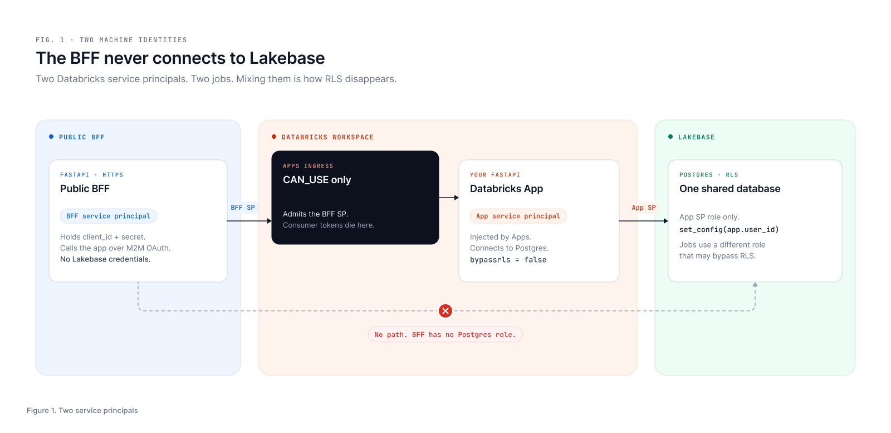
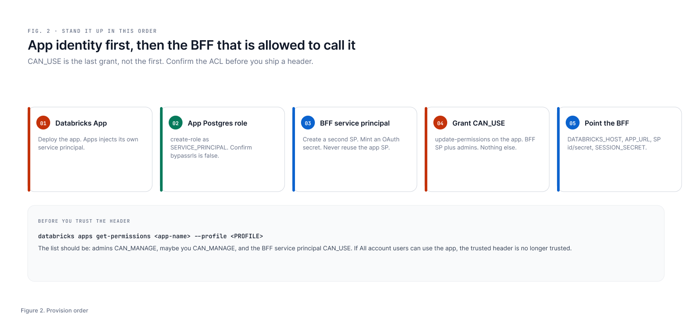

# ios-lakebase-bff

A small public Backend-for-Frontend (BFF) that sits between a native iOS app and a Databricks App backed by Lakebase.

Databricks Apps ingress only admits Databricks principals with `CAN_USE` on the app. An Apple or Auth0 identity token is not one of those. This service is the bridge:

1. Verify the consumer identity token (Apple and/or Auth0 / Okta CIAM).
2. Resolve (or create) a stable internal `user_id` by calling the Databricks App as a machine identity.
3. Issue an app-owned session JWT for the phone.
4. On later calls, validate that session and call the Databricks App with a Databricks OAuth token plus a trusted `X-Cardshop-User-Id` header.

The BFF never connects to Lakebase. Row-level security stays in the Databricks App / Postgres path.

```
iOS  -- Apple or Auth0 ID token -->  BFF (public HTTPS)
       -- verify, resolve user, issue session -->
       -- Databricks SP + X-Cardshop-User-Id -->
Databricks App  -- set_config(app.user_id) + RLS -->  Lakebase
```

This repository is a **sanitized public sample** of that BFF. It is not the production deployment, and it intentionally omits live hosts, workspace IDs, secrets, and tenant-specific deploy notes.

## What this service does

| Route | Auth | Role |
|---|---|---|
| `GET /health` | none | Liveness |
| `GET /me` | Bearer Apple or Auth0 ID token (`X-OIDC-Nonce` when the token has a nonce) | Verify IdP → `POST /internal/users/resolve` on the app → return `user_id` + `session_token` |
| Everything else | Bearer BFF session JWT | Proxy to the Databricks App with `X-Cardshop-User-Id` set |

Proxy routes in `app/main.py` mirror a inventory-style FastAPI app (cards, research, players). Treat them as examples of the session → trusted-header → app pattern. Your backend paths can differ; the identity edge should not.

## Trust model (load-bearing)

- **Only this BFF's Databricks service principal** should have `CAN_USE` on the target app (plus admin identities for manage). That is what makes `X-Cardshop-User-Id` trustworthy.
- The BFF holds **no** Lakebase credentials.
- Face ID (or similar biometrics) on the phone unlocks a retained refresh / session secret. It does not authenticate to Databricks.
- Production apps should reject a missing user header rather than falling back to a bootstrap tenant. That check lives in the Databricks App, not here.

## Configuration

All environment-specific values come from env vars (see `.env.example`). Nothing tenant-specific belongs in source.

| Variable | Purpose |
|---|---|
| `AUTH_ISSUER` | `apple`, `okta`, or `both` |
| `APPLE_BUNDLE_ID` | Apple `aud` |
| `OKTA_ISSUER` / `OKTA_AUDIENCE` / `OKTA_JWKS_URL` | Auth0 or Okta OIDC |
| `DATABRICKS_APP_URL` | Target Databricks App base URL |
| `DATABRICKS_HOST` | Workspace host for M2M OAuth |
| `DATABRICKS_SP_CLIENT_ID` / `DATABRICKS_SP_CLIENT_SECRET` | BFF service principal |
| `SESSION_SECRET` | HMAC key for session JWTs |

Generate a session secret with:

```bash
python3 -c "import secrets; print(secrets.token_urlsafe(32))"
```

## Local development

```bash
python3 -m venv .venv && source .venv/bin/activate
pip install -r requirements.txt
cp .env.example .env   # fill with your own values
uvicorn app.main:app --reload --port 8080
curl localhost:8080/health
```

## Wiring Databricks and Lakebase

The BFF is **not** configured against Lakebase. You configure two Databricks identities, then one Postgres role on the *app* side.



| Identity | What it is | What it may do |
|---|---|---|
| **BFF service principal** | You create this. `DATABRICKS_SP_CLIENT_ID` / `_SECRET` on the BFF. | M2M OAuth into Apps ingress. `CAN_USE` on one app. Nothing else. |
| **App service principal** | Injected by Databricks Apps when you deploy the app. | Connect to Lakebase as one pooled Postgres role. `bypassrls = false`. |
| **Jobs / owner role** (optional, not this repo) | Migrations, catalog loads. | May have `bypassrls = true`. Must never be the app's request-path identity. |

Do not reuse the app SP as the BFF SP. Do not give the BFF a Lakebase password or OAuth Postgres token.



Pass `--profile <PROFILE>` on every Databricks CLI command. List profiles with `databricks auth profiles` and pick the workspace that hosts the app. Do not assume `DEFAULT`.

### 1. Databricks App

Deploy a Databricks App that exposes at least:

- `POST /internal/users/resolve` (no `X-Cardshop-User-Id`; this mints `users.id`)
- RLS-scoped routes that read that header on later calls

Note the app name and its HTTPS URL (`DATABRICKS_APP_URL`). Note the **app** service principal's application id (the identity Apps injected, not the BFF).

```bash
databricks apps list --profile <PROFILE>
databricks apps get <app-name> --profile <PROFILE>
```

### 2. App Postgres role (Lakebase)

This is the identity the Databricks App uses to talk to Postgres. Bind it to the **app** service principal. Confirm it cannot bypass RLS.

```bash
databricks postgres create-role \
  projects/<PROJECT_ID>/branches/<BRANCH_ID> \
  --role-id <APP_SP_CLIENT_ID> \
  --json '{
    "spec": {
      "identity_type": "SERVICE_PRINCIPAL",
      "postgres_role": "<APP_SP_CLIENT_ID>",
      "auth_method": "LAKEBASE_OAUTH_V1"
    }
  }' \
  --profile <PROFILE>

databricks postgres list-roles \
  projects/<PROJECT_ID>/branches/<BRANCH_ID> \
  --profile <PROFILE>
```

`bypassrls` must be `false`. Then grant ordinary DML on tenant tables in SQL (do not add `DATABRICKS_SUPERUSER`). Policies look like:

```sql
SELECT set_config('app.user_id', %s, false);

-- on tenant tables:
USING (user_id = current_setting('app.user_id', true)::uuid)
```

A missing `X-Cardshop-User-Id` should 401 in the app. Do not fall back to a bootstrap UUID in production.

### 3. BFF service principal

A **second** workspace service principal. Display name is yours; keep it obviously not the app.

```bash
databricks service-principals create --display-name "your-app-bff" --profile <PROFILE>
```

The create response includes a workspace numeric `id` and an `applicationId` (UUID). The UUID is `DATABRICKS_SP_CLIENT_ID`. Mint a secret against the numeric id:

```bash
databricks service-principal-secrets-proxy create <SP_NUMERIC_ID> \
  --lifetime 31536000s \
  --profile <PROFILE>
```

That secret is `DATABRICKS_SP_CLIENT_SECRET`. Put it in a secret store, never in git.

`DATABRICKS_HOST` is the workspace URL, for example `https://adb-XXXXXXXXXXXXXXXX.XX.azuredatabricks.net`.

### 4. Grant CAN_USE (and nothing broader)

Apps permissions are **not** the generic `databricks permissions` command. Read the ACL first. `set-permissions` replaces the whole list; prefer `update-permissions` to add the BFF without wiping admins.

```bash
databricks apps get-permissions <app-name> --profile <PROFILE>

databricks apps update-permissions <app-name> --profile <PROFILE> --json '{
  "access_control_list": [
    {
      "service_principal_name": "<BFF_SP_APPLICATION_ID>",
      "permission_level": "CAN_USE"
    }
  ]
}'
```

Then get-permissions again. You want:

- `admins` (inherited) `CAN_MANAGE`
- maybe your user `CAN_MANAGE`
- the BFF SP `CAN_USE`

Turn off "anyone in my organization can use." If that group has `CAN_USE`, any workspace principal can present a forged `X-Cardshop-User-Id`.

### 5. Point this BFF at that stack

Fill `.env` from `.env.example`. The only Databricks values this process needs are host, app URL, and **BFF** SP credentials. Lakebase host, database name, and the app SP stay on the Databricks App.

Generate `SESSION_SECRET` with:

```bash
python3 -c "import secrets; print(secrets.token_urlsafe(32))"
```

Smoke test without iOS:

```bash
curl localhost:8080/health
# then GET /me with a real Apple or Auth0 ID token
```

`/me` should call `POST /internal/users/resolve` as the BFF SP and return a `user_id` plus `session_token`. A 401 at Apps ingress usually means the wrong SP, a missing `CAN_USE`, or `DATABRICKS_APP_URL` pointing at a different app.

## Deploy sketch

Any public HTTPS host that can hold secrets works (Azure Container Apps, Cloud Run, Fly.io, etc.). Pattern:

- Public ingress to this service only.
- Secrets for `DATABRICKS_SP_CLIENT_SECRET` and `SESSION_SECRET` from a secret store / managed identity.
- Fail startup (or at least fail `/me` and proxies loudly) if those secrets are empty in production.
- After a failed platform deploy, confirm the **running image** before debugging auth. Some platforms leave a placeholder image active when a source deploy fails partway.

This sample does not include a production Dockerfile pipeline or IaC on purpose. Wire it to whatever you already operate.

## Layout

```
app/
  main.py              # /health, /me, session gate, proxies
  identity_auth.py     # Apple vs Auth0 issuer routing
  apple_auth.py        # Apple JWKS verify
  okta_auth.py         # Auth0 / Okta JWKS + nonce rules
  session.py           # HS256 session JWT
  databricks_client.py # M2M call + X-Cardshop-User-Id
  config.py            # env-driven settings
  request_context.py   # request id / user correlation for logs
```

## Security notes for reuse

- Do not commit `.env`, PATs, SP secrets, or real workspace hosts.
- Scope `CAN_USE` tightly. A broad grant turns the trusted header into a free tenant switch.
- Prefer rejecting missing `X-Cardshop-User-Id` in the Databricks App over a bootstrap UUID fallback.
- Session tokens here are long-lived HMAC JWTs (`sub` / `iat` / `exp`). Harden for production (shorter TTL, `iss`/`aud`, revocation) if you ship this pattern broadly.
- Auth0 interactive login ID tokens carry a `nonce`; refresh-token ID tokens often do not. The verifier matches that behavior.

## License / status

Reference sample for the architecture described in the accompanying Lakebase + iOS identity write-up. Not an official Databricks product, and not a drop-in production deployment of a live consumer app.
